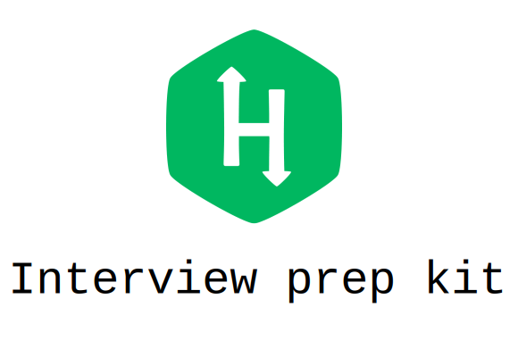

  

# Hackerrank interview prep kit solutions with explanations, see below
Star if you found it useful.
My solutions to Hackerrank's interview preparation kit.
This problem set is online as of June 2018.

# Detailed Explanations
These are the problems for which I have written detailed explanations. I usually write these right after solving the problem. If you still have questions open an issue or send me an email.Before reading the explanations make sure to understand the problems. When writting these I assume that the reader will be very familiar with the context.

## Dictionaries and hashmaps
[Ransom Note Explanation](https://medium.com/carlosbf/hash-tables-ransom-note-solution-76ffe7b4d010)

[Two Strings Explanation](https://medium.com/carlosbf/two-strings-solution-d6cff7f5c11c)

[Sherlok and anagrams Explanation](https://medium.com/carlosbf/sherlock-and-anagrams-solution-6ed20bf7c815)

[Frequency Queries Explanation](https://medium.com/carlosbf/frequency-queries-solution-e776d6ac3aa6)

## Sorting

[Sorting: Comparator Explanation](https://medium.com/@carlosbf/sorting-comparator-solution-84f2c12e8c47)

[Merge Sort: Counting Inversions Explanation](https://medium.com/@carlosbf/merge-sort-counting-inversions-solution-46a0b311b20a)

## String manipulation

[Sherlok and the valid string Explanation](https://medium.com/@carlosbf/sherlock-and-the-valid-string-solution-8611ecc9e0d5)

[Special palindrome again Explanation](https://medium.com/carlosbf/special-palindrome-again-solution-80a31ef3c26c)

[Common child Explanation](https://medium.com/carlosbf/common-child-solution-2e3d6dfb2004)

## Greedy algorithms

[Greedy Florist explanation](https://medium.com/@carlosbf/greedy-florist-solution-cc9e7dda76d7)

[Max min Explanation](https://medium.com/@carlosbf/max-min-solution-cecd440ceaad)

[Reverse Merge Shuffle explanation](https://medium.com/@carlosbf/reverse-shuffle-merge-solution-cfc99de8d5e8)

 ## Search

 [Pairs explanation](https://medium.com/carlosbf/pairs-solution-998f6d03c25d)

 [Triple sum explanation](https://medium.com/carlosbf/triple-sum-solution-af1f9bfc00f6)

 This is a work in progress expect regular updates.
